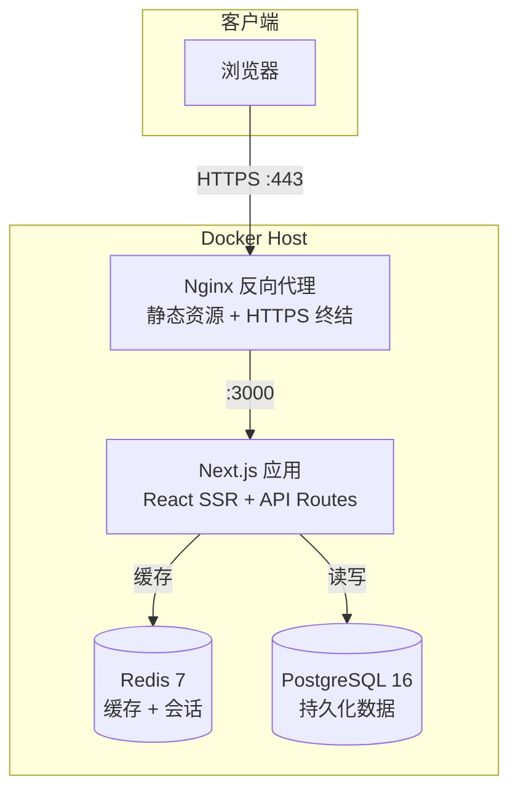
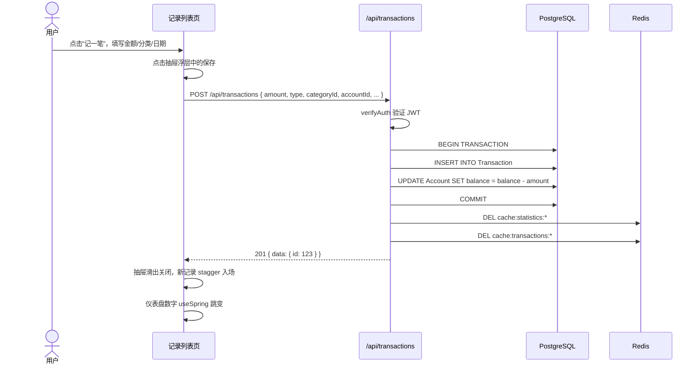
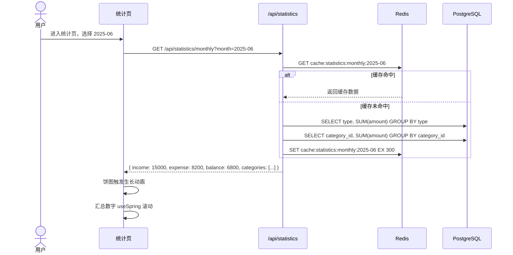
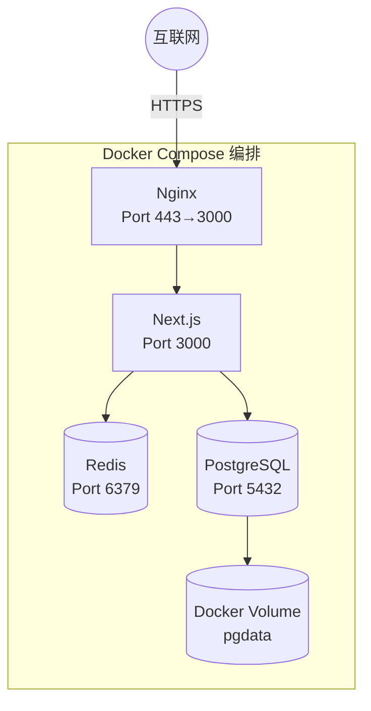

# 框架设计文档（ARCHITECTURE）— PureBook 记账应用

> 基于 [PRD.md](./PRD.md) 的功能需求和 [SPEC.md](./SPEC.md) 的技术选型编写。

## 1. 系统架构图

单体 Next.js 应用架构，所有业务逻辑在 Next.js 内完成。Nginx 作为网关处理 HTTPS 和静态资源，PostgreSQL 存储持久数据，Redis 加速热点查询。

## 2. 模块划分

### 模块：认证模块（auth）

- **职责**：用户注册、登录、JWT 签发与验证
- **对外接口**：`POST /api/auth/login`、`POST /api/auth/register`
- **依赖**：Prisma（User 表）、bcryptjs（密码加密）、jose（JWT）
- **关键实现**：
  - 密码用 bcrypt 加盐哈希存储，不存明文
  - 登录成功后返回 JWT，有效期 7 天，存储于 Cookie（httpOnly + Secure）
  - API 中间件 `verifyAuth` 从 Cookie 提取 Token 并验证，注入 `req.user`

### 模块：交易模块（transactions）

- **职责**：收支记录的增删改查、筛选、导出 CSV
- **对外接口**：`GET/POST /api/transactions`、`GET/PUT/DELETE /api/transactions/[id]`、`GET /api/transactions/export`
- **依赖**：Prisma（Transaction、Account、Category 表）、Redis（列表缓存）
- **关键实现**：
  - 列表查询默认返回最近 30 天，分页每页 20 条
  - 创建/编辑/删除记录时，同步更新关联 Account 的 balance（数据库事务保证一致性）
  - 筛选条件（日期范围、分类、金额范围、关键字）在 API 层解析为 Prisma where 条件
  - CSV 导出流式生成，按日期范围过滤

### 模块：分类模块（categories）

- **职责**：系统预设分类 + 用户自定义分类的 CRUD
- **对外接口**：`GET/POST /api/categories`、`PUT/DELETE /api/categories/[id]`
- **依赖**：Prisma（Category 表）
- **关键实现**：
  - 系统预设分类（`is_preset: true`）不可删除
  - 删除自定义分类时需指定迁移目标分类，该分类下的所有 Transaction 迁移至目标分类
  - 分类列表缓存在 Redis，修改时立即失效

### 模块：账户模块（accounts）

- **职责**：资金账户管理、余额追踪、账户间转账
- **对外接口**：`GET/POST /api/accounts`、`PUT/DELETE /api/accounts/[id]`、`POST /api/accounts/transfer`
- **依赖**：Prisma（Account、Transaction 表）
- **关键实现**：
  - 账户余额实时由关联 Transaction 的 sum 计算，deleted 记录不计入
  - 转账 = 创建两条 Transaction（源账户支出 + 目标账户收入），在数据库事务中完成
  - 删除账户前检查是否有关联记录，有则提示迁移

### 模块：统计模块（statistics）

- **职责**：月度统计概览、收支趋势数据聚合
- **对外接口**：`GET /api/statistics/monthly`、`GET /api/statistics/trend`
- **依赖**：Prisma（Transaction 表）、Redis（聚合结果缓存）
- **关键实现**：
  - 月度统计：当月总收支 + 各分类汇总，SQL GROUP BY 聚合
  - 趋势：近 6 个月逐月 sum，用于柱状图
  - 统计结果缓存 5 分钟（Redis TTL），避免每次切换月份都重新查询

### 模块：前端仪表盘（dashboard）

- **职责**：首页概览，展示本月收支卡片 + 趋势迷你图
- **对外接口**：调用统计 API
- **依赖**：Ant Design Card、Recharts、framer-motion（stagger 入场）
- **关键实现**：
  - 三张核心卡片（收入、支出、结余），金额数字用 `useSpring` 做滚动动效
  - 迷你折线图展示近 6 月趋势
  - 卡片入场 stagger 80ms 依次出现

### 模块：前端统计页（statistics page）

- **职责**：详细统计视图，饼图 + 柱状图 + 分类明细表
- **对外接口**：调用统计 API
- **依赖**：Recharts PieChart/BarChart、framer-motion
- **关键实现**：
  - 饼图按分类展示支出占比，点击分类钻取记录明细
  - 柱状图展示近 6 月收支对比
  - 图表数据加载完成后触发生长动画

### 模块：前端记录管理（transactions page）

- **职责**：记录列表、筛选栏、添加/编辑抽屉
- **对外接口**：调用交易 API
- **依赖**：Ant Design Table/Drawer/DatePicker、framer-motion
- **关键实现**：
  - 列表行 hover 高亮 + scale 微动效
  - 新增/编辑使用右侧抽屉滑入（framer-motion 300ms）
  - 筛选条件改变时列表交叉淡入淡出 150ms
  - 删除时列表项淡出缩小，下方项平滑上移（layout animation）

### 模块：主题模块（theme）

- **职责**：浅色/深色主题定义与切换
- **对外接口**：`useTheme()` Hook
- **依赖**：Ant Design ConfigProvider、Tailwind dark: 类
- **关键实现**：
  - 主题变量定义在 `theme/light.ts` 和 `theme/dark.ts`
  - 切换通过 Ant Design 的 `ConfigProvider theme` prop 注入
  - 切换过渡用 CSS `transition: background-color 0.3s, color 0.3s`
  - 主题偏好存储 localStorage，默认跟随系统

## 3. 核心数据流

### 流程：创建一笔支出记录

### 流程：查看月度统计

## 4. 部署架构

### Docker Compose 服务定义

| 服务 | 镜像 | 端口 | 说明 |
|------|------|------|------|
| nginx | nginx:1.25-alpine | 443 | HTTPS 反向代理 |
| app | node:20-alpine (自构建) | 3000（内部） | Next.js 应用 |
| postgres | postgres:16-alpine | 5432（内部） | 持久化数据库 |
| redis | redis:7-alpine | 6379（内部） | 缓存 |

### 环境规划

| 环境 | 说明 |
|------|------|
| 开发 | `docker compose up postgres redis` 仅启动基础设施，Next.js 用 `npm run dev` 本地热重载 |
| 生产 | `docker compose up -d` 全部启动，Nginx 暴露 443 |

### 扩容策略

单用户应用无需水平扩容。如未来需要，方案为：
- Next.js 无状态，可直接增加实例 + Nginx upstream 负载均衡
- PostgreSQL 单实例，可加只读副本分担统计查询
- Redis 单实例足以覆盖单用户缓存需求

### 监控与日志

- **应用日志**：Next.js 输出 stdout，Docker 通过 `docker logs` 查看
- **数据库慢查询**：PostgreSQL `log_min_duration_statement = 200ms`
- **健康检查**：`GET /api/health` 返回数据库和 Redis 连通状态
- **关键指标**：API 响应时间（p50/p99）、数据库连接数、Redis 命中率
