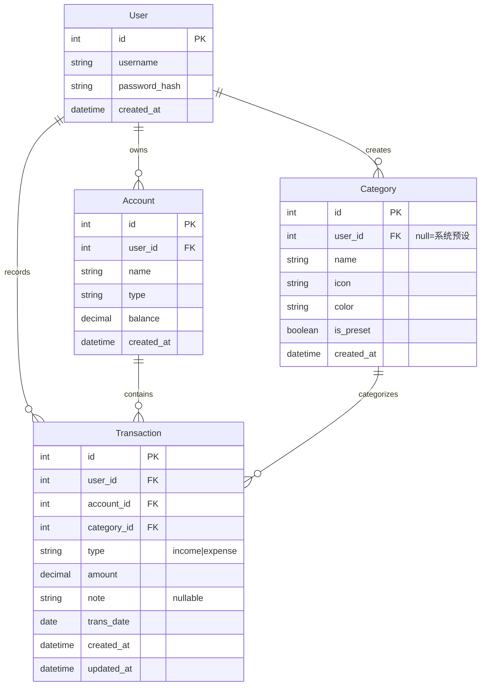

# 技术规范文档（SPEC）— PureBook 记账应用

> 基于 [PRD.md](./PRD.md) 的功能需求编写。

## 1. 技术选型

| 层级 | 技术 | 版本 | 选型理由 |
|------|------|------|----------|
| 前端框架 | React | 18+ | 用户指定；生态成熟、组件化开发效率高 |
| 后端框架 | Next.js | 14+ (App Router) | 用户指定；前后端同仓库、API Routes 天然支持 RESTful、SSR 可选 |
| 开发语言 | TypeScript | 5+ | 全栈类型安全，减少运行时错误 |
| CSS 方案 | Tailwind CSS | 3+ | 原子化 CSS，与 Ant Design 互补做自定义视觉细节，开发效率高 |
| UI 组件库 | Ant Design | 5+ | 中文生态好、表单/表格/图表组件丰富、内置主题系统支持深色模式 |
| 图表库 | Recharts | 2+ | React 原生声明式图表，支持动画过渡；覆盖饼图、柱状图、折线图等所有统计需求 |
| 图标库 | @ant-design/icons | 5+ | 与 Ant Design 配套，2000+ 图标，覆盖分类标记场景 |
| 动画库 | framer-motion | 10+ | React 动画库，用于页面过渡、弹窗动效、列表进出场、仪表盘数字滚动等 |
| 关系数据库 | PostgreSQL | 16+ | 用户指定；ACID 事务、JSON 字段支持、生态最成熟的开源关系库 |
| 缓存 | Redis | 7+ | 用户指定；用于 API 响应缓存和会话管理，显著降低数据库压力 |
| ORM | Prisma | 5+ | TypeScript 优先、类型安全、迁移工具完善、与 Next.js 集成良好 |
| 鉴权 | jose (JWT) | — | 轻量 JWT 库，用于签发和验证 Token；单用户场景无需 OAuth |
| 密码加密 | bcryptjs | — | 纯 JS 实现，跨平台无编译问题 |
| 容器化 | Docker + Docker Compose | — | 用户指定自部署；多服务编排一键启动 |
| 反向代理 | Nginx | 1.25+ | Docker Compose 中的入口网关，处理 HTTPS 终结和静态资源 |

### 为什么用 Next.js 而非纯 React + Express？

| 对比维度 | Next.js | React + Express |
|----------|---------|-----------------|
| 项目结构 | 前后端同仓库，一个 `npm run dev` 全部启动 | 前后端分离，两个仓库/两个端口 |
| API 开发 | API Routes 零配置，文件即路由 | 需要手动搭建 Express 路由 |
| 部署 | `next build && next start` 一条命令 | 需要分别部署前端静态资源 + 后端服务 |
| 单用户场景 | 完全够用，无过度设计 | 额外引入一个框架的复杂度 |

结论：单用户记账应用属于小规模项目，Next.js 的全栈一体化方案比前后端分离更合适，减少不必要的复杂度。

## 2. 数据模型

### 实体关系图



### 实体：User（用户）

| 字段名 | 类型 | 约束 | 说明 |
|--------|------|------|------|
| id | INT | PK, AUTO_INCREMENT | 用户唯一 ID |
| username | VARCHAR(50) | NOT NULL, UNIQUE | 登录用户名 |
| password_hash | VARCHAR(255) | NOT NULL | bcrypt 加密后的密码 |
| created_at | TIMESTAMP | NOT NULL, DEFAULT NOW() | 创建时间 |

### 实体：Account（账户）

| 字段名 | 类型 | 约束 | 说明 |
|--------|------|------|------|
| id | INT | PK, AUTO_INCREMENT | 账户唯一 ID |
| user_id | INT | FK → User.id, NOT NULL | 所属用户 |
| name | VARCHAR(50) | NOT NULL | 账户名称，如"工资卡" |
| type | VARCHAR(20) | NOT NULL | 账户类型：cash / bank / credit |
| balance | DECIMAL(12,2) | NOT NULL, DEFAULT 0 | 当前余额 |
| created_at | TIMESTAMP | NOT NULL, DEFAULT NOW() | 创建时间 |

### 实体：Category（分类）

| 字段名 | 类型 | 约束 | 说明 |
|--------|------|------|------|
| id | INT | PK, AUTO_INCREMENT | 分类唯一 ID |
| user_id | INT | FK → User.id, NULLABLE | 所属用户；NULL 表示系统预设 |
| name | VARCHAR(30) | NOT NULL | 分类名称 |
| icon | VARCHAR(50) | NOT NULL | 图标标识 |
| color | VARCHAR(7) | NOT NULL | 颜色 HEX 值，如 #FF6B6B |
| is_preset | BOOLEAN | NOT NULL, DEFAULT FALSE | 是否系统预设分类 |
| created_at | TIMESTAMP | NOT NULL, DEFAULT NOW() | 创建时间 |

### 实体：Transaction（交易记录）

| 字段名 | 类型 | 约束 | 说明 |
|--------|------|------|------|
| id | INT | PK, AUTO_INCREMENT | 记录唯一 ID |
| user_id | INT | FK → User.id, NOT NULL | 所属用户 |
| account_id | INT | FK → Account.id, NOT NULL | 关联账户 |
| category_id | INT | FK → Category.id, NOT NULL | 关联分类 |
| type | VARCHAR(10) | NOT NULL, CHECK IN ('income','expense') | 收入或支出 |
| amount | DECIMAL(12,2) | NOT NULL, > 0 | 金额 |
| note | VARCHAR(200) | NULLABLE | 备注 |
| trans_date | DATE | NOT NULL | 交易日期 |
| created_at | TIMESTAMP | NOT NULL, DEFAULT NOW() | 创建时间 |
| updated_at | TIMESTAMP | NOT NULL, DEFAULT NOW() | 最后更新时间 |

### 索引设计

| 索引名 | 字段 | 用途 |
|--------|------|------|
| idx_transaction_user_date | (user_id, trans_date DESC) | 按用户+日期查询记录列表 |
| idx_transaction_user_category | (user_id, category_id) | 按分类筛选 |
| idx_transaction_user_type | (user_id, type) | 按收支类型筛选 |
| idx_transaction_account | (account_id) | 按账户查询 |

## 3. API 接口列表（RESTful 概览）

| 方法 | 路径 | 说明 | 鉴权 |
|------|------|------|------|
| POST | /api/auth/login | 用户登录 | 否 |
| POST | /api/auth/register | 用户注册 | 否 |
| GET | /api/transactions | 获取收支记录列表（支持分页+筛选） | 是 |
| POST | /api/transactions | 创建收支记录 | 是 |
| GET | /api/transactions/[id] | 获取单条记录详情 | 是 |
| PUT | /api/transactions/[id] | 更新收支记录 | 是 |
| DELETE | /api/transactions/[id] | 删除收支记录 | 是 |
| GET | /api/categories | 获取所有分类 | 是 |
| POST | /api/categories | 创建自定义分类 | 是 |
| PUT | /api/categories/[id] | 编辑分类 | 是 |
| DELETE | /api/categories/[id] | 删除分类（带迁移） | 是 |
| GET | /api/accounts | 获取所有账户 | 是 |
| POST | /api/accounts | 创建账户 | 是 |
| PUT | /api/accounts/[id] | 编辑账户 | 是 |
| DELETE | /api/accounts/[id] | 删除账户 | 是 |
| POST | /api/accounts/transfer | 账户间转账 | 是 |
| GET | /api/statistics/monthly | 月度统计概览 | 是 |
| GET | /api/statistics/trend | 近 6 月收支趋势 | 是 |
| GET | /api/transactions/export | 导出 CSV | 是 |

> 详细接口定义见 [API.md](./API.md)。

## 4. 项目目录结构

```
PureBook/
├── src/
│   ├── app/                      # Next.js App Router 页面
│   │   ├── layout.tsx            # 根布局（全局样式、Provider）
│   │   ├── page.tsx              # 首页（仪表盘）
│   │   ├── login/
│   │   │   └── page.tsx          # 登录页
│   │   ├── transactions/
│   │   │   ├── page.tsx          # 收支记录列表页
│   │   │   └── [id]/
│   │   │       └── page.tsx      # 记录编辑页
│   │   ├── categories/
│   │   │   └── page.tsx          # 分类管理页
│   │   ├── accounts/
│   │   │   └── page.tsx          # 账户管理页
│   │   └── statistics/
│   │       └── page.tsx          # 统计概览页
│   ├── api/                      # Next.js API Routes（RESTful 后端）
│   │   ├── auth/
│   │   │   ├── login/route.ts    # POST /api/auth/login
│   │   │   └── register/route.ts # POST /api/auth/register
│   │   ├── transactions/
│   │   │   ├── route.ts          # GET/POST /api/transactions
│   │   │   ├── [id]/route.ts     # GET/PUT/DELETE /api/transactions/[id]
│   │   │   └── export/route.ts   # GET /api/transactions/export
│   │   ├── categories/
│   │   │   ├── route.ts          # GET/POST /api/categories
│   │   │   └── [id]/route.ts     # PUT/DELETE /api/categories/[id]
│   │   ├── accounts/
│   │   │   ├── route.ts          # GET/POST /api/accounts
│   │   │   ├── [id]/route.ts     # PUT/DELETE /api/accounts/[id]
│   │   │   └── transfer/route.ts # POST /api/accounts/transfer
│   │   └── statistics/
│   │       ├── monthly/route.ts  # GET /api/statistics/monthly
│   │       └── trend/route.ts    # GET /api/statistics/trend
│   ├── components/               # React 通用组件
│   │   ├── layout/               # 布局组件（Header, Sidebar）
│   │   ├── dashboard/            # 仪表盘卡片：收支概览、迷你趋势图
│   │   ├── transaction/          # 记录表单、记录列表项（含分类图标+颜色标识）
│   │   ├── category/             # 分类选择器、彩色标签
│   │   ├── chart/                # 饼图、柱状图、趋势折线图封装（含动画）
│   │   └── ui/                   # 通用 UI（空状态插画、加载骨架屏、确认弹窗、浮动按钮）
│   ├── lib/                      # 工具库
│   │   ├── prisma.ts             # Prisma 客户端单例
│   │   ├── redis.ts              # Redis 客户端单例
│   │   ├── auth.ts               # JWT 签发/验证逻辑
│   │   └── utils.ts              # 通用工具函数（格式化金额、日期等）
│   ├── hooks/                    # 自定义 React Hooks
│   │   ├── useTransactions.ts
│   │   ├── useCategories.ts
│   │   ├── useStatistics.ts
│   │   └── useTheme.ts           # 主题切换 Hook
│   ├── theme/                    # 主题配置
│   │   ├── light.ts              # 浅色主题变量
│   │   ├── dark.ts               # 深色主题变量
│   │   └── index.ts              # Ant Design ConfigProvider 主题注入
│   └── types/                    # TypeScript 类型定义
│       └── index.ts              # 共享类型（Transaction, Category 等）
├── prisma/
│   ├── schema.prisma             # Prisma Schema（数据模型定义）
│   ├── migrations/               # 数据库迁移文件
│   └── seed.ts                   # 种子数据（预设分类）
├── public/                       # 静态资源
│   └── favicon.ico
├── docker/
│   ├── Dockerfile                # Next.js 应用镜像
│   └── nginx.conf                # Nginx 反向代理配置
├── docker-compose.yml            # 多服务编排
├── .env.example                  # 环境变量模板
├── package.json
├── tsconfig.json
├── tailwind.config.ts            # Tailwind CSS 配置（与 Ant Design 配合）
├── next.config.js
└── README.md
```

## 5. 动画模式规范

整个应用的动画分为四个层级，由 framer-motion 实现：

### 路由级动画

页面切换时使用淡入淡出 + 轻微上移，避免生硬的跳转：

```tsx
// 页面容器
<motion.div
  initial={{ opacity: 0, y: 12 }}
  animate={{ opacity: 1, y: 0 }}
  exit={{ opacity: 0, y: -12 }}
  transition={{ duration: 0.2, ease: "easeOut" }}
>
  {children}
</motion.div>
```

### 组件入场动画

- **仪表盘卡片**：页面加载后依次出现，每张卡片间隔 80ms（stagger）
- **列表项**：首次加载时从下往上渐显，后续分页加载不再触发入场动画
- **弹窗/抽屉**：从右侧滑入 300ms，关闭时滑出 200ms
- **图表**：数据加载完成后，图表从 0 到实际值的生长动画

### 微交互

- **数字跳动**：仪表盘金额数字变化时使用 `useSpring` 实现数字滚动效果
- **按钮涟漪**：点击时从触点扩散圆形涟漪，使用 CSS `@keyframes` 即可
- **hover 反馈**：卡片 hover 时 `scale: 1.02` + `box-shadow` 加深，过渡 150ms
- **加载骨架屏**：Ant Design Skeleton 组件，数据加载完成后淡出消失

### 空状态与过渡态

- 各页面首次无数据时展示 Lottie 或 SVG 插画空状态，配引导文案
- 删除操作：列表项淡出缩小后，下方项平滑上移填补空位（layout animation）
- 筛选切换：记录列表内容交叉淡入淡出 150ms，不丢上下文

